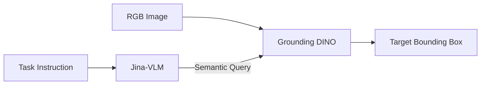
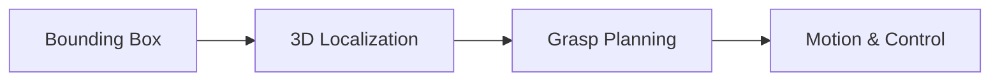

# Adv_Control_Systems
Projects contained in this repository and the key technology used in it. For more information, checkout the [Resources](https://github.com/Jash-2000/Adv_Control_Systems/tree/main/Resources) folder in this repository:

1. Pick and Throw Robot -- A major project that simulation, dynamics, perception, and control pipeline for a 3-link planar robotic arm capable of picking arbitrary objects and throwing them accurately to a target location.
2.Segway Hybrid Control -- Used a **hybrid(cont.+ disc. time) controller** to self-balance and move a segway system.
3. Dual Pendulum Control -- Uses a LQG(Linear Quadratic Guassian) Controller to stabilize the system 
4. Acrobot Swingup -- Uses **Partial Feedback Linearization** for swing-up of the system, and then stabilizing near the fully-upright equilibrium via an **LQR (linear quadratic regulator)** balancing control.
5. Mountain Car -- Uses **Tracking controllter** that plans the min fuel path using Trajectory Optimization and implements the feedback with LQR.
6. Pendubot Swingup -- Uses **Trajectory Optimization** for swingup trajectory with minimum joint efforts.
7. Acrobot Controller -- Use a feedback controller that uses TO inside **MPC(Model Predictive Controller)** to move the acrobot from one equilibrium to another equilibrium.
8. Cart Pendulum State Estimation and Control -- Uses **Kalman Filter** to estimate the states and apply LQR controller to stabilize the self-balancing cart.
   
---
**Perception Module**

The perception module provides task-aware, open-vocabulary object localization by fusing vision-language reasoning with language-conditioned detection. This enables the robot to identify and localize arbitrary objects specified through natural language instructions. The system integrates:
  - **Jina-VLM** for high-level task and object understanding
  - **Grounding DINO** for precise spatial localization

Given an RGB image and a task description, Jina-VLM extracts the semantic intent of the task and generates an object-level query. This query conditions Grounding DINO to produce an accurate bounding box for the target object, which is then forwarded to the manipulation stack.

**Vision–Language Fusion**

**Output to Control Stack**
The perception output consists of a task-consistent bounding box and object centroid, which are transformed into world coordinates and used by the grasp planner, state estimator, and trajectory optimizer.

---

The motivation on using multiple techniques as to understand the fundamental difference between different methods:

| Controller Type | Uses Current State? | Adaptive? | How control is computed                 |
| --------------- | ------------------- | --------- | --------------------------------------- |
| **Feedforward** | ❌ No                | ❌ No      | Precomputed control sequence            |
| **PID/LQR**     | ✔ Yes               | ❌ No      | Closed-form formula                     |
| **MPC**         | ✔ Yes               | ✔ Yes     | Repeated online trajectory optimization |

---

A Kalman State Update Equation with Controller Law being u = -Hx becomes x^+=Ax^+Bu+Kf​(z−Hx^). Here, z is the system output and x^ is the estimation of the internal state "x", which can not be measured.
This is an interesting equation where **Ax^** corresponds to the dynamics, **Bu** corresponds to the feedforward input and **Kf​(z−Hx^)** corresponds to the feedback where z is supposed to follow u=-Hx
Given the importance of Kalman based estimators, its difference from a classical observer is as follows:
| Feature              | Classical Observer (Luenberger) | Kalman Filter                           |
| -------------------- | ------------------------------- | --------------------------------------- |
| Noise handling       | Does NOT explicitly model noise | Models process & measurement noise      |
| Optimality           | No optimality guarantee         | Optimal (minimum variance estimate)     |
| Gain selection       | Designer chooses poles manually | Gain computed automatically from (Q, R) |
| Uncertainty tracking | No covariance                   | Tracks covariance (P)                   |
| Output               | Single “best guess”             | Best guess + uncertainty                |
| Use case             | Clean models, little noise      | Real-world noisy systems                |

---

A feedback controller is generally required to study even in case of simulation because of how the optimizations are performed. Even if you follow the optimized trajectory perfectly:
- Interpolation errors: u_ref and x_ref are usually interpolated from discrete points.These Linear interpolation introduces small deviations between collocation points.
- Feedback control differences: In trajectory optimization, you might design a time-varying LQR. If the system deviates slightly, the feedback acts on this error, creating small differences in the trajectory.
- Nonlinearities and solver tolerances: The optimization might use a simplified or linearized model. Real Systems follow the full nonlinear dynamics, so small differences accumulate over time.
- Discrete vs continuous enforcement: Trajectory optimization enforces dynamics only at discrete points, not between them. Solvers like ode45 fills in the gaps, revealing deviations that weren’t penalized in optimization.
